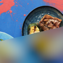

  

# 
Blurhash <small>for Shopware</small> <small><small>Teaser your Images</small></small>

  
  
  
  

**A full integration of [Blurhash](https://blurha.sh/) for Shopware 6.**

---

### Not a _placeholder_, but a wholesome Teaser Image!

- 🏞 **Teaser Images** with a **blurry** representation of the original image
- 🔥 **Tiny!** Only a few dozen bytes <small>(~0.0001% of the image)</small>, therefore delivered with the **first response**
- 🚀 Decoded **by the clients'** browser **itself**
- 🌈 Configuration of **Performance** and **Quality** parameters to **fit your needs**
- 💻 **Emulated integration** - targets **all types of images** used by the storefront and your theme
- 😎 Quite casually: **Lazy images**, **reduced jumping of content** and much more...

---

## Table of contents

- [About Blurhash](#what-is-blurhash)
- [Documentation](https://leptoquark1.github.io/sw-blurhash)
  - [Basic Usage](https://leptoquark1.github.io/sw-blurhash/#/guide)
  - [Configuration](https://leptoquark1.github.io/sw-blurhash/#/configuration)
  - [Customization](https://leptoquark1.github.io/sw-blurhash/#/customization)
  - [Integrated Workflows](https://leptoquark1.github.io/sw-blurhash/#/integrated-workflows)
  - [Commands (cli)](https://leptoquark1.github.io/sw-blurhash/#/commands)
- [System Requirements](#system-requirements)
- [Licence](#licence)

---

## About

### What is Blurhash

According [to itself](https://blurha.sh/), it describes to be as follows

> Blurhash is a compact representation of a placeholder for an image.

However, this does not illustrate the enormous clout that this particular feature brings to bear!

### What is Blurhash for Shopware

- Optimized Performance & Resources - Generate as efficiently as possible using PHP and Shopware peer dependencies
- Integration into the default Shopware "Theme System", providing the best possible coverage
- Fast generation of the Blurhash Teaser Image (decoded Blurhash) in the client browser
- Comfortable control the processing and integration in the Shopware Administration
- Configuration of Performance and Quality parameters to fit your needs
- Options to outsource the generation process to skirt 'PHP', 'Process' or even the 'System' bottlenecks

## Installation

Use one of the recommended ways to install this plugin in your Shopware Installation:

- Directly from [Extension Store](https://store.shopware.com/en/eyeco82567775599f/blurhash-teaser-your-images.html) in your Shopware Administration
- Clone this repository into the `custom/plugins` folder and install it using command line `bin/console plugin:install --refresh EyecookBlurhash`
<!-- - 🎉 **New** -  Using composer: `composer require leptoquark1/sw-blurhash` and install it using command line `bin/console plugin:install --refresh EyecookBlurhash` --> 

This plugin is free and open source. But if you like this plugin you can support me by buying a version with support using the [Official Extension Store](https://store.shopware.com/en/eyeco82567775599f/blurhash-teaser-your-images.html?number=eyeco82567775599s) 

## System Requirements

### PHP Extensions

- PHP version 8.1.* | 8.2.*
- ext-gd (GD Graphics Library)
- ext-json

## Licence

This software is created by David Fecke (leptoquark1) and licensed under [Apache 2](https://github.com/leptoquark1/sw-blurhash/blob/main/LICENSE).

Initial concept and underlying structure is derived from an [algorithm](https://github.com/woltapp/blurhash/blob/master/Algorithm.md) original created by [Wolt Enterprises](https://github.com/woltapp/blurhash), licensed under [MIT License](https://github.com/woltapp/blurhash/blob/master/License.md).
