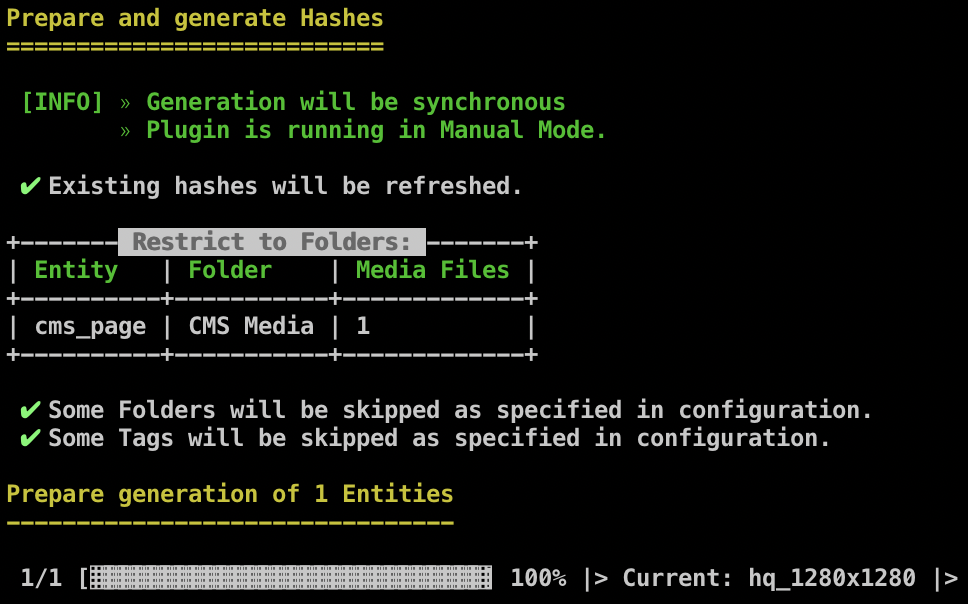

## Commands (cli)

### Generate

Process all generations synchronously without subsequent worker processes. This can bring advantages in terms of troubleshooting but also performance.

Usage:
`ec:blurhash:generate [options] [<entities>...]`

| Argument / Option | Description                                                          | -        | 
|-------------------|----------------------------------------------------------------------|----------|
| entities          | Restrict to specific entities. (_Comma separated list of entities._) | optional |
| -a, --all         | Include images that already have a hash.                             | optional |
| -s, --sync        | Process the generation in this thread.                               | optional |
| -d, --dryRun      | Just show how many media entities are affected                       | optional |

Example:

```bash
bin/console ec:blurhash:generate product --all --sync
```

|  |
|------------------------------------------------------------------------------------|
| _Example output of `ec:blurhash:generate cms_page --sync --all`_                   |

### Remove

Remove (previously generated) Blurhashes from media entities.

Usage:
`ec:blurhash:remove [options] [<entities>...]`

| Argument / Option | Description                                                          | -        | 
|-------------------|----------------------------------------------------------------------|----------|
| entities          | Restrict to specific entities. (_Comma separated list of entities._) | optional |
| -a, --all         | All Blurhashes will be removed. Everywhere!                          | optional |
| -d, --dryRun      | Just show how many media entities are affected                       | optional |

> � **Please consider**
>
> When providing the `--all` option, the entities' argument is ignored!


Example:

```bash
bin/console ec:blurhash:remove cms_page --dryRun
```