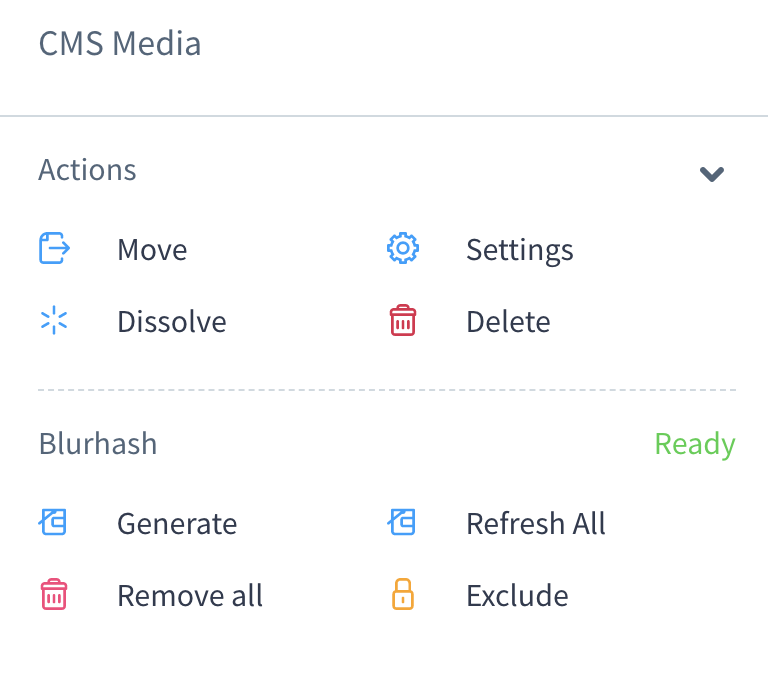
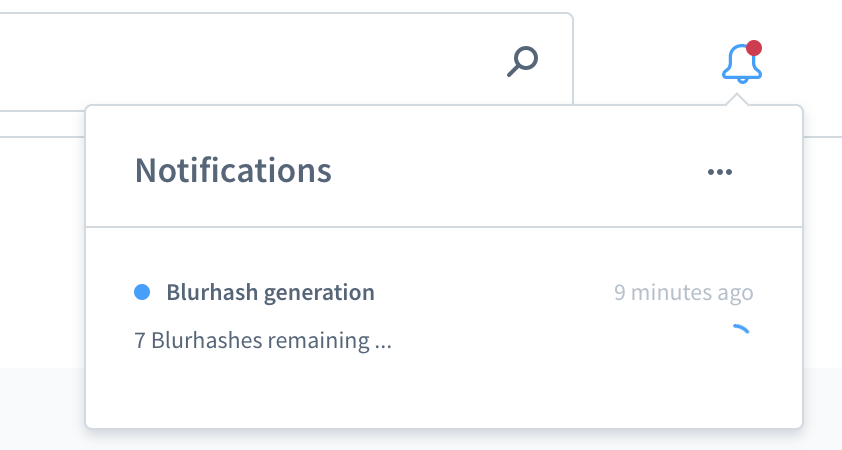
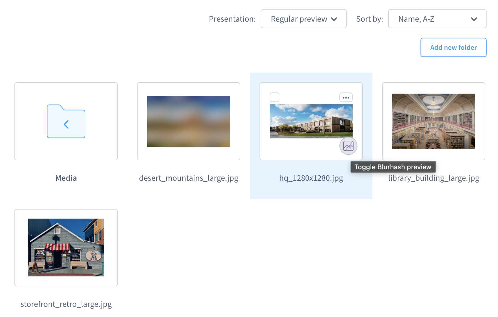

## Basic Usage

### Administration

The vast amount of features is easily accessible via the Shopware administration.

However, there are a few restrictions and pitfalls to consider:

- All generation actions will be submitted **Asynchronous**
- Generation is **not possible** when in [Manual Mode](configuration.md#manual-mode) and the [Admin Worker](https://docs.shopware.com/en/shopware-6-en/tutorials-und-faq/deactivate-the-admin-worker#what-is-the-admin-worker) is disabled.

#### The Media Browser

_Blurhash is where you manage your images_: With the Media Browser, you can access all the relevant actions to enrich images with a Blurhash.

The sidebar does provide you with all relevant information and possible actions to execute on either an image or the whole folder.

|  |
|-------------------------------------------------------------------------------------------------------|
| _Sidebar of the Mediabrowser when a folder is selected_                                               |

##### Bulk in folder scope

When a folder is selected you can generate Blurhashes for all containing images (excl. sub-folders).

Following actions are available:

| Action        | Description                                                                       |
|---------------|-----------------------------------------------------------------------------------|
| `Generate`    | Generate missing Blurhashes for all suitable images in this folder                |
| `Refresh all` | Generate and overwrite existing Blurhashes for all suitable images in this folder |
| `Remove all`  | Remove all generated Blurhashes from images this folder                           |

##### Media Scope

Once a image has been selected, it will be verified whether it is suitable for Blurhash generation.

> If the validation fails, a notice with the reason for the failure will be displayed.

If the image is suitable, the following actions are available:

| Action     | Description                                                 |
|------------|-------------------------------------------------------------|
| `Generate` | Generate a Blurhash for this image                          |
| `Refresh`  | Generate all and overwrite existing Blurhash for this image |
| `Remove`   | Remove an existing Blurhash from this image                 |

#### Notifications

You can track the ongoing processing in the Notification-Center.

|  |
|-------------------------------------------------------------------------------------------------|
| _Processing message in Notifications_                                                           |

Following Messages are available:

- By Action: The processing of a folder was submitted
- By Action: The processing of an image was submitted
- While processing: the remaining items in the queue
- The processing is finished

> ❗ Some messages can be lost when handled in a short time period (Fast processing or errors)

#### Preview Teaser Images

If a preview is available, you can toggle it by clicking the icon in the bottom right corner of the image.

> � Preview requirement is that the image has a generated Blurhash.

|  |
|---------------------------------------------------------------------------------------------------|
| _Blurhash Teaser preview in the Mediabrowser_                                                     |

### Integrated Workflows

#### Generation

A generation of Blurhash is triggered automatically when either a thumbnail is generated or updated.

> ❗**Warning**
>
> The automatic generation **does not work** when the [Admin Worker](https://docs.shopware.com/en/shopware-6-en/tutorials-und-faq/deactivate-the-admin-worker#what-is-the-admin-worker) is enabled.

